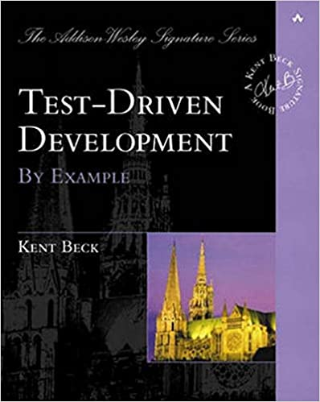

# Test-Driven Development by example

Currently re-learning TDD from Kent Beck's Book. 
Going to apply those concepts in Swift as a package.  

You can buy the book from [Amazon](https://www.amazon.com/Test-Driven-Development-Kent-Beck/dp/0321146530)
